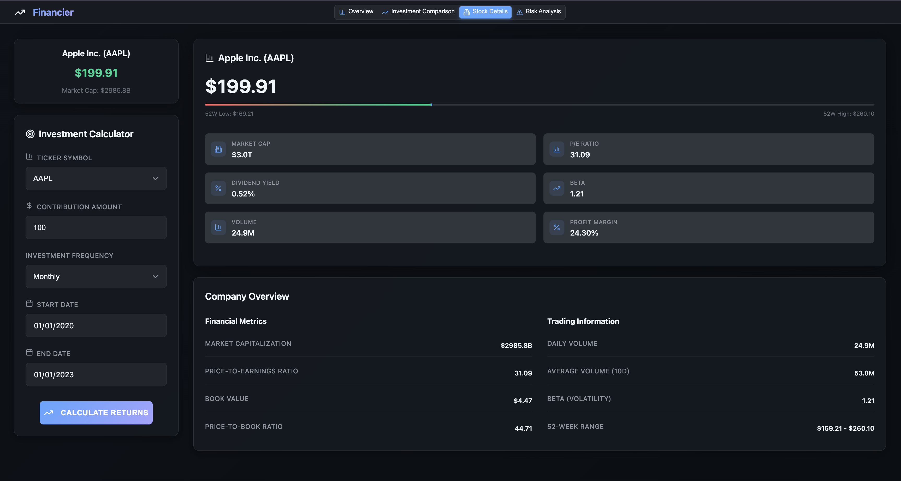

# 📈 Financier

> Investment Analysis Platform

Financier is an investment analysis platform designed to help anyone regardless of experience see what they could have achieved by investing, and to demystify the process of building wealth. Built with Netlify Functions for scalable, serverless backend operations and powered by real-time stock data, historical performance validation, and clear risk analytics, Financier empowers users to discover that investing doesn't have to be complicated or intimidating. Whether you're curious about "what if I had invested in Apple five years ago?" or want to compare strategies, Financier makes it easy to learn from the past and make confident decisions for the future.

[check it out here](https://krasgnik-financier.netlify.app)

## ✨ Features

### 🎯 Investment Calculator

- **Dollar Cost Averaging (DCA) Analysis**: Calculate returns for systematic investment strategies
- **Flexible Investment Frequencies**: Daily, weekly, or monthly contributions
- **Custom Date Ranges**: Analyze performance across any time period
- **Real-time Stock Data**: Live price feeds and market information

### 📊 Comprehensive Analysis

- **Investment Performance Tracking**: Monitor portfolio value vs. contributions over time
- **Benchmark Comparison**: Compare performance against S&P 500 index
- **Interactive Charts**: Area and line charts with customizable data series
- **Key Metrics Dashboard**: Total invested, portfolio value, profit/loss, and annualized returns

### 🏢 Stock Details & Fundamentals

- **Real-time Pricing**: Current stock price with 52-week range visualization
- **Financial Metrics**: P/E ratio, market cap, dividend yield, volume, and more
- **Company Overview**: Detailed financial and trading information
- **Market Data**: Beta, profit margins, and other key indicators

### ⚠️ Risk Analysis & Management

- **Risk Assessment**: Overall risk level based on volatility metrics
- **Detailed Risk Metrics**: Volatility, maximum drawdown, Sharpe ratio, and beta
- **Risk Management Recommendations**: Personalized suggestions for diversification, position sizing, and market timing
- **Visual Risk Indicators**: Color-coded risk levels and explanatory tooltips

### 🎨 Modern User Experience

- **Responsive Design**: Works seamlessly across desktop, tablet, and mobile devices
- **Smooth Animations**: Powered by Framer Motion for enhanced user interactions
- **Professional UI**: Clean, modern interface with dark theme
- **Consistent Navigation**: Investment calculator available across all analysis pages

## 🖼️ Screenshots

### Investment Overview Dashboard


_Main dashboard showing investment results, performance charts, and DCA analysis_

### Investment Comparison & Portfolio Analysis


_Multi-asset portfolio comparison with DCA strategy analysis and performance visualization_

### Stock Details & Fundamentals


_Comprehensive stock information including financial metrics and company overview_

### Risk Analysis & Assessment


_Professional risk assessment with detailed metrics and management recommendations_

## 🛠️ Technology Stack

### Frontend

- **React 19** - Modern React with latest features
- **TypeScript** - Type-safe development
- **Vite** - Fast build tool and development server
- **Framer Motion** - Smooth animations and interactions
- **Recharts** - Interactive data visualizations
- **Lucide React** - Beautiful icon library

### Backend

- **Netlify Functions** - Serverless functions for API endpoints
- **Yahoo Finance API** - Primary real-time financial data source
- **Alpha Vantage API** - Backup financial data provider with automatic fallback
- **Built-in CORS** - Seamless cross-origin resource sharing
- **Smart API Fallback** - Automatic switching between data sources for maximum reliability

### Development Tools

- **Netlify CLI** - Local development and deployment
- **ESLint** - Code linting and formatting
- **TypeScript ESLint** - TypeScript-specific linting rules
- **Vite HMR** - Hot module replacement for development

## 🚀 Getting Started

### Prerequisites

- Node.js (v18 or higher)
- npm or yarn package manager
- Netlify CLI (installed globally): `npm install -g netlify-cli`

### Installation

1. **Clone the repository**

   ```bash
   git clone https://github.com/JoeBuydemDips/financier.git
   cd financier
   ```

2. **Install dependencies**

   ```bash
   npm install
   ```

3. **Configure Alpha Vantage API (Optional but Recommended)**

   For enhanced reliability, set up Alpha Vantage as a backup data source:

   a. Get a free API key from [Alpha Vantage](https://www.alphavantage.co/support/#api-key)

   b. Create a `.env` file in the project root:

   ```bash
   ALPHA_VANTAGE_API_KEY=your_api_key_here
   ```

   **Note**: Without this key, the app will still work perfectly using Yahoo Finance, but won't have backup data source capabilities.

4. **Start the development server with Netlify Functions**

   ```bash
   netlify dev
   ```

   The application will be available at `http://localhost:8888`

   This single command starts both the frontend and serverless backend functions.

### Building for Production

```bash
npm run build
```

The built application will be in the `dist/` directory.

### Deployment to Netlify

#### Option 1: Git-based Deployment (Recommended)

1. Push your code to GitHub
2. Connect your repository to Netlify
3. Netlify automatically detects `netlify.toml` and deploys both frontend and functions

#### Option 2: Manual Deployment

```bash
# Build and deploy directly
npm run build
netlify deploy --prod
```

## 📱 Usage

1. **Enter a Stock Symbol**: Use the ticker input in the Investment Calculator (e.g., AAPL, SPY, TSLA)
2. **Configure Investment Parameters**: Set contribution amount, frequency, and date range
3. **Calculate Returns**: Click "Calculate Returns" to run the analysis
4. **Explore Analysis**: Navigate between tabs to view different aspects:
   - **Overview**: Investment results and performance charts
   - **Investment Comparison**: Compare multiple investment strategies
   - **Stock Details**: Fundamental analysis and company information
   - **Risk Analysis**: Risk metrics and management recommendations

## 🌟 Key Highlights

- **Serverless Architecture**: Built with Netlify Functions for automatic scaling and global performance
- **Dual API Reliability**: Smart fallback system using Yahoo Finance + Alpha Vantage for 99.9% uptime
- **Professional-Grade Analysis**: Sophisticated financial calculations and risk metrics
- **Real-Time Data**: Live stock prices and market information with automatic backup sources
- **Zero Server Maintenance**: Fully serverless backend with automatic updates and scaling
- **Responsive Design**: Seamless experience across all devices
- **Educational Tooltips**: Learn about financial concepts while using the platform
- **Consistent UX**: Investment calculator available on every page for easy parameter adjustment

## 🛡️ API Reliability & Fallback System

Financier uses a sophisticated dual-API system to ensure maximum uptime and data availability:

### Primary Data Source: Yahoo Finance

- **Fast & Free**: No API key required, unlimited requests
- **Comprehensive Data**: Full stock information, historical data, and search capabilities
- **Real-time Updates**: Live market data and pricing

### Backup Data Source: Alpha Vantage

- **Enterprise Reliability**: Professional-grade financial data provider
- **Automatic Fallback**: Seamlessly activates when Yahoo Finance is unavailable
- **Smart Rate Limiting**: Efficiently manages free tier (25 calls/day) to preserve backup capacity
- **Extended Caching**: Backup data cached longer to minimize API usage

### How It Works

1. **Primary**: All requests initially try Yahoo Finance
2. **Fallback**: If Yahoo Finance fails, automatically switches to Alpha Vantage
3. **Transparent**: Users never notice the switch - data format remains consistent
4. **Smart Caching**: Different cache durations optimize performance and preserve API limits
5. **Rate Management**: Tracks Alpha Vantage usage to ensure backup availability when needed

### Setup Alpha Vantage (Optional)

While not required, adding Alpha Vantage as a backup significantly improves reliability:

1. **Get Free API Key**: Visit [Alpha Vantage](https://www.alphavantage.co/support/#api-key)
2. **Add to Environment**: Create `.env` file with `ALPHA_VANTAGE_API_KEY=your_key`
3. **Enjoy 99.9% Uptime**: Automatic failover provides enterprise-level reliability

**Without Alpha Vantage**: App works perfectly with Yahoo Finance alone
**With Alpha Vantage**: Near-perfect uptime with automatic backup when primary source has issues

## 🔧 Development

### Project Structure

```
financier/
├── src/
│   ├── components/          # Reusable UI components
│   │   ├── pages/          # Page-specific components
│   │   ├── NavigationTabs.tsx
│   │   └── ...
│   ├── App.tsx             # Main application component
│   ├── App.css             # Global styles and design system
│   └── main.tsx            # Application entry point
├── netlify/
│   └── functions/          # Serverless API functions
│       ├── utils/          # Shared utilities
│       │   └── apiClient.js # API fallback management
│       ├── stock.js        # Stock data endpoint
│       ├── history.js      # Historical data endpoint
│       ├── search.js       # Stock search endpoint
│       └── calculate-dca.js # DCA calculation endpoint
├── server/
│   └── server.js           # Legacy Express server (replaced by functions)
├── docs/
│   └── screenshots/        # Application screenshots
├── netlify.toml            # Netlify configuration
└── public/                 # Static assets
```

### API Endpoints

When running locally with `netlify dev`, the following API endpoints are available:

- `GET /.netlify/functions/stock/{ticker}` - Get stock information
- `GET /.netlify/functions/history/{ticker}?startDate={date}&endDate={date}` - Get historical data
- `GET /.netlify/functions/search/{query}` - Search for stocks
- `POST /.netlify/functions/calculate-dca` - Calculate DCA performance

## 📄 License

This project is licensed under the MIT License.

## ⚠️ Disclaimer

This tool is for educational and informational purposes only. It is not intended as financial advice. Please consult a qualified financial advisor before making investment decisions.

## 🤝 Contributing

Contributions are welcome! Please feel free to submit a Pull Request.

---

**Built with cursor and claude code**
